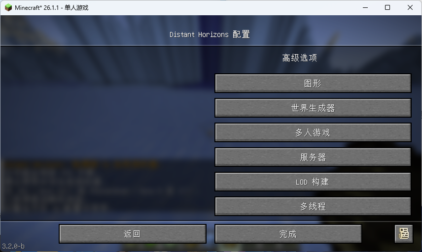
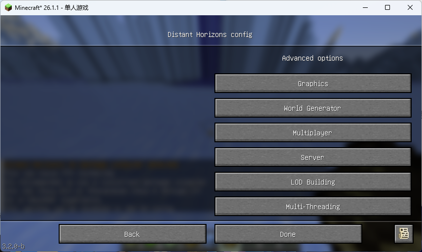
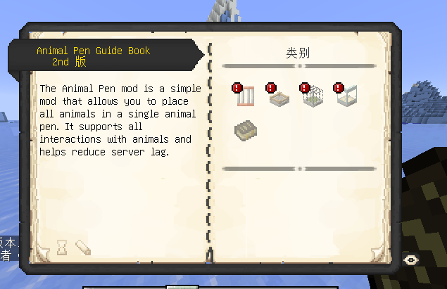
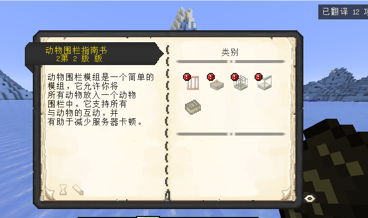
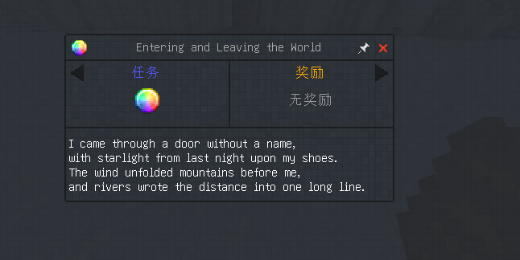
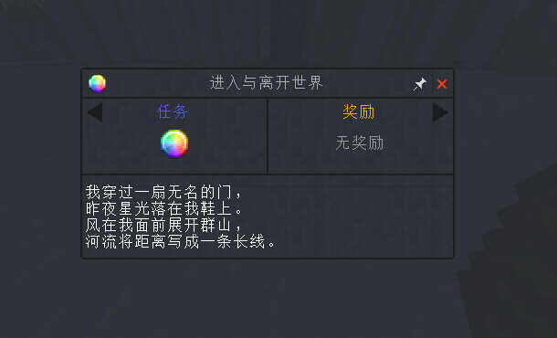
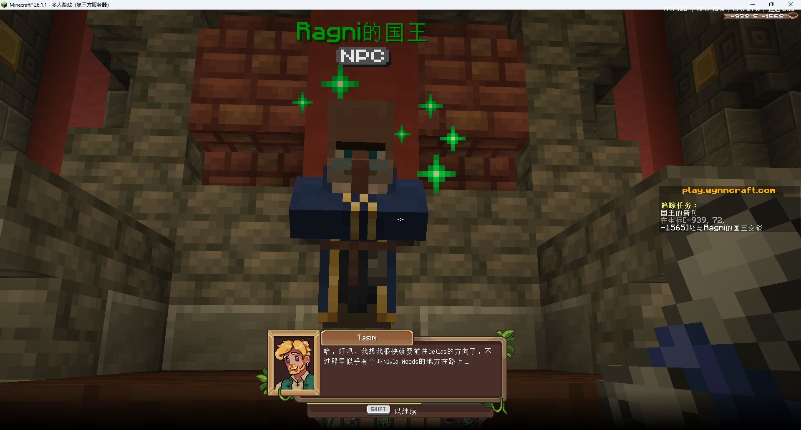

# SimpleTranslate 2.1.28

**语言 / Language:** [中文](#中文) | [English](#english)

SimpleTranslate is a client-side, real-time Minecraft translation mod. It translates chat, item tooltips, books, signs, HUD text, and other mods' GUIs through the language model/API configured by the player.

SimpleTranslate 是客户端 Minecraft 实时翻译模组，可通过玩家自行配置的模型/API 翻译聊天、物品提示、书本、告示牌、HUD，以及其他模组的 GUI。

*整屏 GUI 翻译保留 Distant Horizons 的按钮布局。 / Whole-screen GUI translation preserves the Distant Horizons button layout.*

## 截图 / Screenshots

### 整屏 GUI / Whole-screen GUI

| 翻译前 / Before | 翻译后 / After |
| --- | --- |
|  |  |

*Distant Horizons 配置界面的整屏翻译。 / Whole-screen translation of the Distant Horizons configuration UI.*

### Patchouli 手册 / Patchouli guide

| 翻译前 / Before | 翻译后 / After |
| --- | --- |
|  |  |

*Patchouli 手册翻译保留书页结构和分类图标。 / Patchouli guide translation preserves the page structure and category icons.*

### FTB Quests

| 翻译前 / Before | 翻译后 / After |
| --- | --- |
|  |  |

*FTB Quests 兼容保留任务窗口结构。 / FTB Quests compatibility preserves the task window structure.*

### Wynncraft

*Wynncraft 对话翻译保留专用头像、字形和对话框布局。 / Wynncraft dialogue translation preserves its portrait, glyphs, and dialogue layout.*

Wynncraft, Wynntils, Patchouli, FTB Quests, Distant Horizons, Iceberg, and Legendary Tooltips are third-party projects or services. Compatibility descriptions and screenshots demonstrate SimpleTranslate only; they do not imply affiliation, endorsement, sponsorship, or official cooperation.

Wynncraft、Wynntils、Patchouli、FTB Quests、Distant Horizons、Iceberg 和 Legendary Tooltips 均为第三方项目或服务。兼容性描述与截图仅用于展示 SimpleTranslate，不代表隶属、认可、赞助或官方合作。

---

## 中文

### 主要功能

- **多文本表面翻译**：接收和发送的聊天、物品提示、悬浮提示、书本、告示牌、计分板、玩家列表、Boss 栏、标题、Actionbar、实体名称和文字展示实体。
- **整屏 GUI 翻译**：可按快捷键（默认 `K`）翻译当前界面，也可启用自动模式；输入框不会作为待翻译文本发送，明显的 URL 和技术 ID 会被跳过。
- **其他模组 GUI**：可翻译普通 Minecraft Component 驱动的模组界面，例如 Patchouli 手册、FTB Quests 和 Distant Horizons。
- **Wynncraft 专用支持**：Minecraft `>=1.21.4` 的对应 Fabric/NeoForge 版本包含对话与 Actionbar 语义投影、布局和字形覆盖层，以及 Wynntils HUD 兼容。该功能依据 Wynncraft 的字体、字形锚点和布局结构识别内容，不依赖服务器地址。
- **结构保真**：所有游戏文本表面使用 Component JSON 数组管线。译文会重新绑定到当前画面的组件结构，以保留样式、布局、点击事件、动态数字和资源包图标；普通可见文本中的隐藏悬浮事件不会被顺带发送，而由专用悬浮提示路径处理。
- **物品提示缓存**：物品 Tooltip 会用当前帧的图标、样式、数值和间距重新绑定语义译文；已有持久缓存可在物品 Tooltip 首次显示时直接命中。
- **上下文和配置档**：可以按聊天、物品、GUI、HUD、书本、告示牌等来源选择是否向 API 提供历史译文，并为全局、服务器或单人世界保存参考提示词。
- **可配置快捷键**：支持键盘和鼠标组合键，可配置全局翻译开关、聊天模式、GUI、Tooltip、告示牌操作和各表面的“按住显示原文”。
- **任意语言方向**：模组不限定英译中；实际可用语言、质量、速度和费用由玩家选择的模型/API 决定。

### 支持版本

请下载与 Minecraft 版本和加载器完全匹配的文件。

| 加载器 | Minecraft 版本 | 数量 |
| --- | --- | ---: |
| Fabric | 1.12.2、1.16.5、1.18.2、1.19.2–1.19.4、1.20–1.20.6、1.21–1.21.11、26.1、26.1.1、26.1.2、26.2 | 29 |
| Forge | 1.12.2、1.16.5、1.18.2、1.19.2、1.20.1 | 5 |
| NeoForge | 1.20.1–1.20.6、1.21–1.21.11、26.1、26.1.1、26.1.2、26.2 | 22 |

Fabric 1.12.2 是功能面较窄的 Legacy 版本；部分现代 GUI、文本组件和兼容功能只存在于较新的 Minecraft 版本。Wynncraft 专用功能仅随 Minecraft `>=1.21.4` 的目标提供。

### 安装与配置

1. 安装对应 Minecraft 版本的 Fabric、Forge 或 NeoForge。
2. Fabric 版本按下载页要求安装 Fabric API；其他加载器也应遵循对应文件页列出的依赖。
   **仅 Forge 1.12.2 目标**还必须安装 [MixinBooter 9.4 或更高版本](https://github.com/CleanroomMC/MixinBooter)；SimpleTranslate 不打包该运行依赖，其他目标不需要它。
3. 将匹配版本的 SimpleTranslate JAR 放入客户端实例的 `mods` 目录。
4. 在游戏内设置页配置 API 地址、密钥、模型和语言方向。Mod Menu 是 Fabric 上推荐但非必需的设置入口。

SimpleTranslate 不内置免费翻译引擎、模型或 API 额度。请自行选择兼容服务，并了解其隐私、计费和数据处理政策。服务器无需安装本模组。

### 升级说明

- 持久化命名空间继续使用 `stx2`，新缓存继续使用 `component_json_v1`。
- 兼容的旧 `json.<surface>` Component 缓存可在满足条件时惰性迁移；更旧的 wire/style 缓存保持停用，不会被当作当前译文使用。
- 旧单键快捷键会迁移为组合键；旧语言默认值只迁移已知的 `en -> auto` 和 `zh -> zh_cn` 情况。
- 升级不会无条件清空用户缓存。无效或结构不兼容的单条记录仍可能被正常淘汰。

### 链接

- [GitHub Releases](https://github.com/baokaixina/SimpleTranslate/releases)
- [MC百科](https://www.mcmod.cn/class/23154.html)
- [2.1.28 累计更新日志](CHANGELOG.md)
- [MIT 许可证](LICENSE)

---

## English

### Features

- **Broad text-surface coverage:** received and outgoing chat, item and hover tooltips, books, signs, scoreboards, the player list, boss bars, titles, actionbars, entity names, and text display entities.
- **Whole-screen GUI translation:** translate the current screen with a shortcut (`K` by default) or enable automatic mode. Input fields are excluded from requests, and obvious URLs and technical IDs are skipped.
- **Other mods' GUIs:** translate ordinary Component-driven mod interfaces, including Patchouli guides, FTB Quests, and Distant Horizons.
- **Dedicated Wynncraft support:** matching Fabric/NeoForge targets for Minecraft `>=1.21.4` include semantic dialogue and actionbar projection, layout and glyph overlays, and Wynntils HUD compatibility. Detection uses Wynncraft fonts, glyph anchors, and verified layout structure rather than a server-address allowlist.
- **Structure-preserving translation:** every game-text surface uses the Component JSON array pipeline. Translated semantics are rebound to the current component tree to retain styling, layout, click events, dynamic numbers, and resource-pack icons. Hidden hover events in ordinary visible text are not sent incidentally; dedicated hover paths translate tooltip content.
- **Item-tooltip caching:** item tooltips rebind semantic translations to each frame's live icons, styles, values, and spacing. Existing persistent entries can be used on the first item-tooltip render.
- **Context and profiles:** choose which translated text sources may be supplied to the API as history, and save reference prompts for global, server, or single-player-world scopes.
- **Configurable chords:** assign keyboard and mouse chords for the global toggle, chat mode, GUI and tooltip translation, sign actions, and per-surface hold-to-show-original controls.
- **Any model-supported language direction:** the mod does not lock translation to English-to-Chinese. Available languages, quality, latency, and cost depend on the model/API selected by the player.

### Supported versions

Download the file that exactly matches both the Minecraft version and loader.

| Loader | Minecraft versions | Count |
| --- | --- | ---: |
| Fabric | 1.12.2, 1.16.5, 1.18.2, 1.19.2–1.19.4, 1.20–1.20.6, 1.21–1.21.11, 26.1, 26.1.1, 26.1.2, 26.2 | 29 |
| Forge | 1.12.2, 1.16.5, 1.18.2, 1.19.2, 1.20.1 | 5 |
| NeoForge | 1.20.1–1.20.6, 1.21–1.21.11, 26.1, 26.1.1, 26.1.2, 26.2 | 22 |

Fabric 1.12.2 is a narrower Legacy build. Some modern GUI, text-component, and compatibility features only exist on newer Minecraft targets. Dedicated Wynncraft features are included only on Minecraft `>=1.21.4` targets.

### Installation and configuration

1. Install Fabric, Forge, or NeoForge for the exact Minecraft version.
2. For Fabric, install Fabric API as required by the download page. Follow the dependency list on the matching file page for other loaders.
   **Only the Forge 1.12.2 target** also requires [MixinBooter 9.4 or newer](https://github.com/CleanroomMC/MixinBooter). SimpleTranslate does not bundle this runtime dependency, and no other target requires it.
3. Put the matching SimpleTranslate JAR in the client instance's `mods` directory.
4. Configure the API URL, key, model, and language direction in the in-game settings. Mod Menu is recommended, but not required, as a Fabric settings entry point.

SimpleTranslate does not bundle a free translation engine, hosted model, or API quota. Choose a compatible service and review its privacy, billing, and data-processing policies. The server does not need to install this mod.

### Upgrade notes

- The persistence namespace remains `stx2`, and new cache entries remain `component_json_v1`.
- Compatible legacy `json.<surface>` Component entries may migrate lazily when allowed. Older wire/style generations remain inactive and are not used as current translations.
- Legacy single-key bindings migrate to chords. Language defaults migrate only for the known `en -> auto` and `zh -> zh_cn` cases.
- Upgrading does not unconditionally clear user caches. Individual invalid or structurally incompatible entries can still be discarded normally.

### Links

- [GitHub Releases](https://github.com/baokaixina/SimpleTranslate/releases)
- [MC百科](https://www.mcmod.cn/class/23154.html)
- [Cumulative 2.1.28 changelog](CHANGELOG.md)
- [MIT License](LICENSE)
